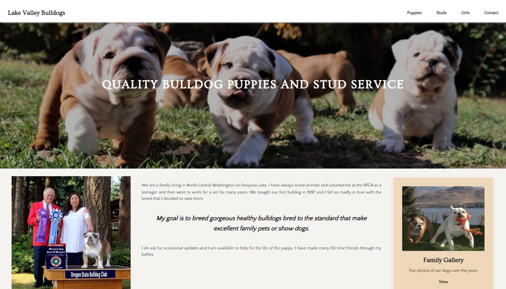

# Company Home Page with Flexbox

A Codecademy project in the Front-End-Engineer career path. 

## Description 
In this project, I used flexbox to design and build the layout for the Lake Valley Bulldogs homepage.

## Snapshot

## Link 

## Credits
Content sourced from [Lake Valley Bulldogs](https://www.lakevalleybulldogs.org/).

Bulldog favicon created by [Triberion](https://www.flaticon.com/free-icons/dog).

## Questions 
[Email Me](Chloe.a.harris17@gmail.com) if you have any questions.

Check out more of my work on [GitHub](https://github.com/chloeharris1).
